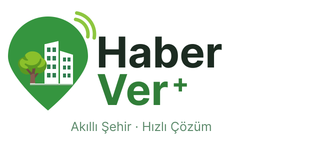

# Haber Ver+

Belediyenin şehirdeki ağaçları, park mobilyalarını ve aydınlatma direklerini
harita üzerinden takip ettiği bakım/otomasyon sistemi. Saha ekibi kendine
atanan işi günceller, personel dashboard'dan raporlama/atama yapar, vatandaş
"bu ağaç kurumuş" gibi bir talep gönderir.

## Teknik yığın

- **Frontend:** React 18 + Vite, TypeScript, Tailwind, MapLibre GL JS
- **Backend:** Python / FastAPI, SQLAlchemy + Alembic
- **Kimlik:** Keycloak (OIDC), BFF deseni — token tarayıcıya gitmez
- **Veritabanı:** PostgreSQL + PostGIS
- **Servis:** Docker Compose (postgres, keycloak, backend, frontend)

## Kurulum

Tek gereksinim [Docker](https://www.docker.com/)'dır; Node/Python/PostgreSQL
kurmanıza gerek yok.

**1. Projeyi indirin**

```bash
git clone <repo-url> haberver
cd haberver
```

**2. `.env` dosyasını oluşturun** (Windows `cmd`: `copy`)

```bash
cp .env.example .env
```

Lokal kullanımda **düzenleme gerekmez**. Yalnızca 5173 / 8000 / 8081 / 5432
portlarından biri doluysa ilgili `*_PORT` satırını değiştirin.

**3. Servisleri başlatın**

```bash
docker compose up -d
```

Veritabanını kurar, migration'ları uygular, Keycloak'ı ve ilk admin hesabını
hazırlar, backend/frontend'i başlatır. İlk çalıştırma birkaç dakika sürer;
`docker compose logs -f backend` çıktısında
`[entrypoint] Uygulama baslatiliyor...` satırını görünce hazırdır.

**4. Demo veri yükleyin** (opsiyonel)

Kurulum boş gelir (yalnızca admin hesabı). Sistemi dolu görmek için:

```bash
docker compose exec backend python scripts/seed_demo.py
```

**5. Giriş yapın**

**http://localhost:5173** adresini açın. Demo veri yüklediyseniz aşağıdaki
hesaplarla, yüklemediyseniz `.env`'deki admin bilgileriyle girin.

### Adresler

| | Adres |
|---|---|
| Uygulama | http://localhost:5173 |
| API dokümantasyonu | http://localhost:8000/docs |
| Keycloak yönetim konsolu | http://localhost:8081 |

Keycloak konsoluna `.env`'deki `KEYCLOAK_ADMIN` / `KEYCLOAK_ADMIN_PASSWORD`
ile girilir — bu hesap **uygulamanın `admin` rolüyle aynı şey değildir**,
yalnızca Keycloak'ın kendi yönetim arayüzü içindir.

### Sorun giderme

| Durum | Çözüm |
|---|---|
| Port çakışması (`port is already allocated`) | `.env`'deki ilgili `*_PORT` değerini değiştirip `docker compose up -d` |
| Servislerin durumunu görmek | `docker compose ps` |
| Hata ayıklama | `docker compose logs -f backend` (ya da `keycloak`, `frontend`) |
| `keycloak/realm-haberver.json`'u değiştirdim, etkisi yok | Realm import'u yalnızca realm yokken çalışır: `docker compose down && docker volume rm haberver_kcdata && docker compose up -d` (Keycloak kullanıcıları silinir, uygulama verisi durur) |
| Sıfırdan başlamak | `docker compose down -v` — **tüm veriyi ve yüklenmiş talep fotoğraflarını siler** |

## Demo hesaplar (yalnızca geliştirme için)

| Rol | Hesap | Parola |
|---|---|---|
| Saha ekibi | `sahaekibi1@haberver.com` … `sahaekibi10@haberver.com` | `saha1234` |
| Personel | `calisan1@haberver.com`, `calisan2@haberver.com` | `calisan1234` |
| Vatandaş | `vatandas1@haberver.com` | `vatandas1234` |
| Admin | `.env`'deki `DEFAULT_ADMIN_EMAIL` | `.env`'deki `DEFAULT_ADMIN_PASSWORD` |

## ⚠️ Parola tuzakları

1. **`KEYCLOAK_ADMIN_PASSWORD` yalnızca ilk açılışta okunur.** `kcdata`
   volume'ü oluştuktan sonra parola veritabanında yaşar, `.env`'i değiştirmek
   etkisizdir. Değiştirmenin yolu: Keycloak konsolu → kullanıcı menüsü →
   *Manage account*.
2. **Mevcut bir hesap için `.env`'i değiştirmek parolayı sıfırlamaz.**
   `DEFAULT_ADMIN_PASSWORD` yalnızca sıfırdan kuruluma uygulanır; mevcut
   `admin@haberver.com` için parola Keycloak konsolundan sıfırlanmalı.

## Testler

Backend script'leri ayakta duran sisteme karşı çalışır, argüman almaz:

```bash
docker compose exec backend python scripts/guvenlik_testi.py    # yetki/kapsam sınırları
docker compose exec backend python scripts/auth_akis_testi.py   # OIDC giriş akışı
```

Frontend testleri **host'ta** çalıştırılır (container'daki Node sürümü
yetersiz): `cd frontend && npm test`

## Lisans / atıf

Harita sınır verisi OpenStreetMap'ten üretiliyor: **Data © OpenStreetMap
contributors, ODbL 1.0 — https://osm.org/copyright**. Diğer 80 il
[ttezer/turkiye-harita-verisi](https://github.com/ttezer/turkiye-harita-verisi)
(HDX COD-AB-TUR, **CC BY-IGO**) kaynaklıdır.

**Harita altlığı uyarısı:** *Uydu* ve *Hibrit* stilleri Google'ın
dokümante edilmemiş, API anahtarı gerektirmeyen bir raster tile ucunu
kullanır — bu resmi bir servis değildir ve herhangi bir zamanda
engellenebilir. Bilinçli bir geliştirme kolaylığı tercihidir; production'da
MapTiler veya Google Maps JS API'ye geçilmelidir.
